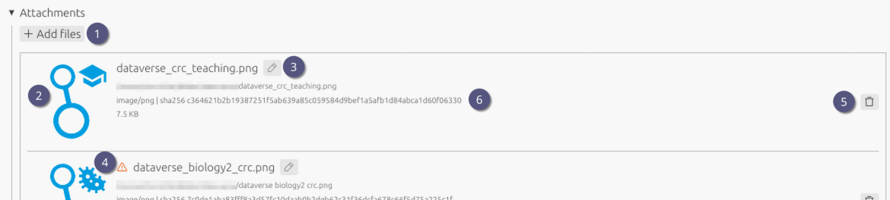

# Attachments

1. Click **Add files** to open the file picker. Select all files you want to attach.
2. A thumbnail will be shown for each file if possible.
3. Use the **Edit** button to rename files directly from the list.
4. If a file has been automatically renamed, this will be indicated by a warning icon. Hover the icon to see the original name.
5. To delete files, click the **Delete** button next to each file.
6. Beneath the filename, **additional information** such as file size, MIME type and SHA256 hash are displayed.

> [!TIP]
> Files are hashed twice: first when adding an attachment, and again when saving
> the ELN archive. If the hashes do not match, an error message is shown.
>
> This helps ensure that files are not modified in between and that the file
> saved in the archive is identical to the one you attached.
