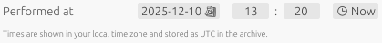

# Date & Time Picker

- Pick the calendar date and clock time of the experiment.
- You can click on the **Now** button to use the current date and time.
- The chosen value is stored in the archive metadata.
- During a later ELN import, this exact timestamp is used as creation date.

> [!TIP]
> Backfill older experiments by setting the original date and time.
