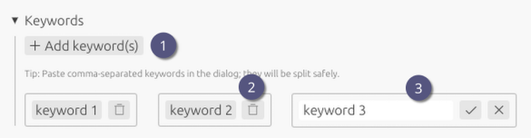

# Keywords

1. Add short search terms (e.g., technique, instrument, sample ID) to make entries easier to find after import.
2. Delete by clicking the trash icon.
3. Edit inline by clicking on the keyword.

> [!TIP]
>
> - Comma-separated import is supported by pasting a list: `microscopy, TEM, project A`.
> - Keywords are automatically deduplicated.
