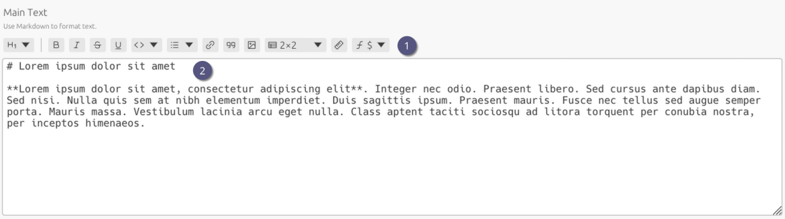

# Markdown Editor

1. Toolbar buttons insert Markdown at the cursor. From left to right:
   - Headings (Dropdown): `# H1`…`# H6`
   - Bold: `**bold**`
   - Italic: `*italic*`
   - Strikethrough: `~~strikethrough~~`
   - Underline: `__underline__`
   - Code (Dropdown): inline and block code
   - Lists (Dropdown): `* list item` and `1. numbered list item`
   - Links: `[link text](url)`
   - Blockquote: `> blockquote`
   - Images: ``
   - Tables: `| header | header |`…`| row | row |`
   - Horizontal Rule: `---`
   - Math (Dropdown): inline `$\math$` and block `$$\math$$`
2. Use the editor for the experiment description, steps, and results. The resulting Markdown is by default converted to HTML when exporting the ELN archive.

> [!TIP]
>
> - You can use all features of [CommonMark](https://commonmark.org) with some additional Markdown extensions like tables and math.
> - Use raw HTML in the Markdown code for more advanced formatting. Keep in mind though that HTML is sanitized when exporting the ELN archive to prevent XSS attacks which may remove **potentially unsafe** HTML tags (e.g., `<script>`).

> [!NOTE]
> Currently the **image insertion** feature is ignorant of your file attachments. You can however use it to reference external images by providing their URLs.
