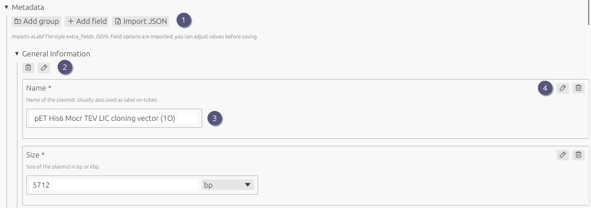
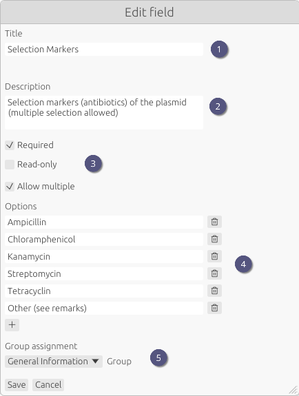

# Metadata

1. **Add groups** and metadata **fields** by clicking the respective buttons.
2. **Edit** existing groups or **delete** them.
3. **Fill in** the fields with appropriate values.
4. **[Edit](metadata.md#edit-field-properties)** or **delete** fields. This includes changing the label or options.

> [!TIP]
> Field types cannot be changed after creation. To change a field type, you must delete the field and recreate it with the desired type.

## Edit field properties

Here you can change the **title** (1) and **description** (2) of a metadata field. You can also choose whether the field is **required**, read-only and other **settings** which are specific to the field type (3). In some cases such as selection fields or numeric fields, **options** can be added or removed (4).

Finally, you can also change the assigned **group** of the field (5).

Click **Save** to apply your changes.
