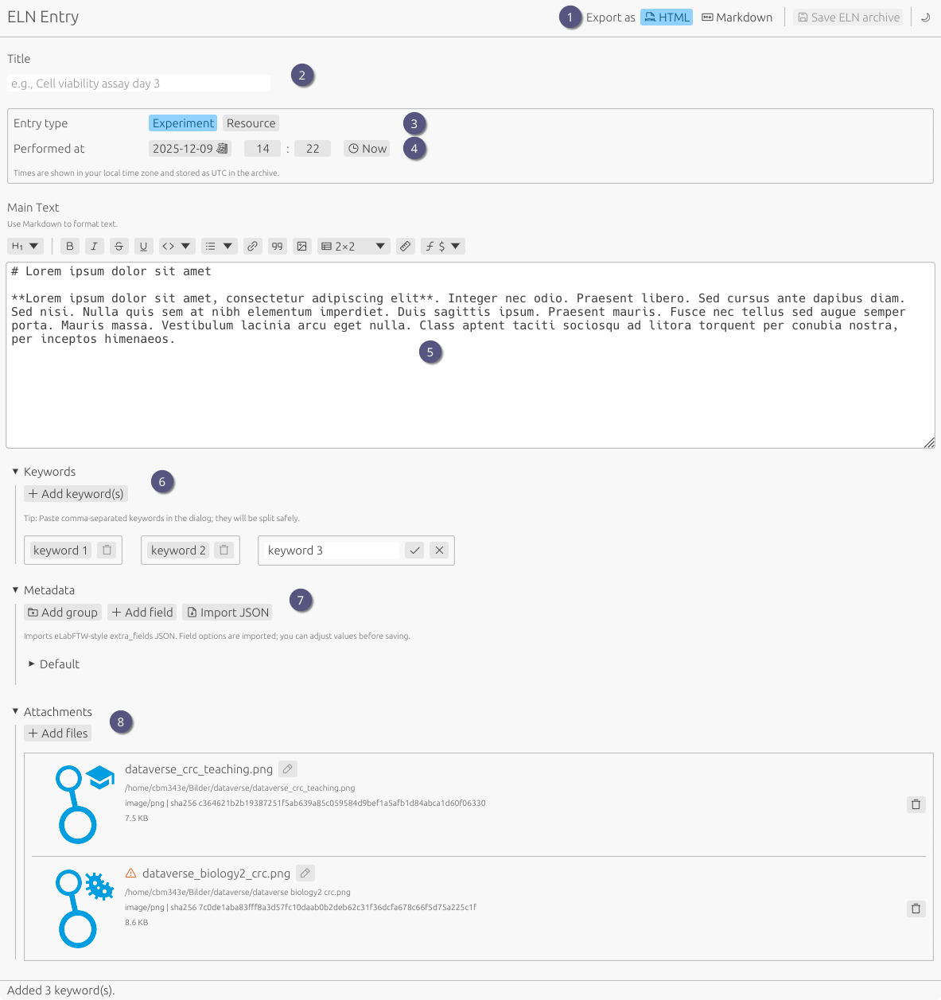

# UI Overview

Key areas on the screen:

1. **[ELN export controls](saving.md)**: Switch between export formats of the main text HTML (default) and Markdown; Button to save the final ELN archive.
2. **Title**: enter a short title.
3. **Type**: choose the entry type (Experiment/Resource). Defines the type of the entry when imported into eLabFTW.
4. **[Performed at](datetime.md)**: set date, time, and timezone (local time shown; stored as UTC).
5. **[Main text](markdown.md)**: editor with toolbar for headings, emphasis, lists, links, code, superscript/subscript, tables, and math.
6. **[Keywords](keywords.md)**: add comma-separated keywords via the dialog.
7. **[Metadata](metadata.md)**: add structured metadata; import from eLabFTW extra fields JSON or create from scratch. Will be exported as eLabFTW compatible extra fields in the final ELN archive.
8. **[Attachments](attachments.md)**: attach files to the archive. Filenames will be automatically sanitized and checked for duplicates. File content is hashed and checked for integrity and possible duplicates.
